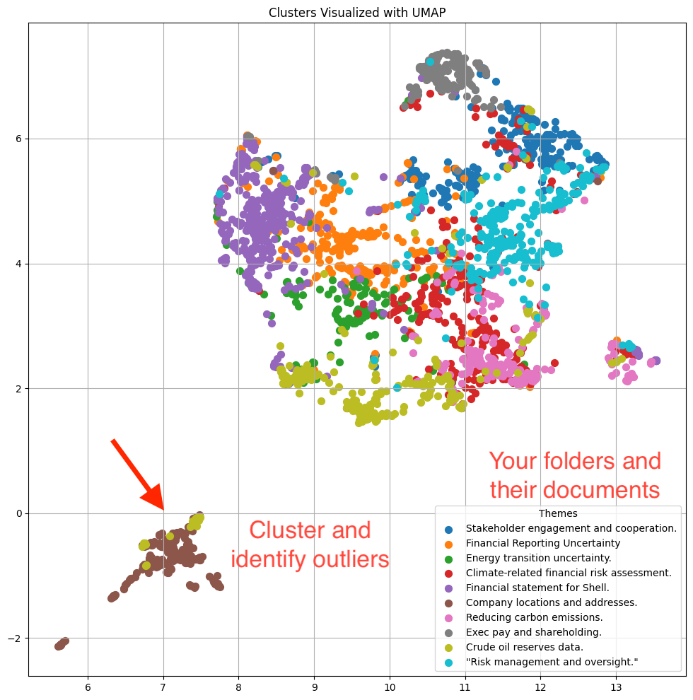
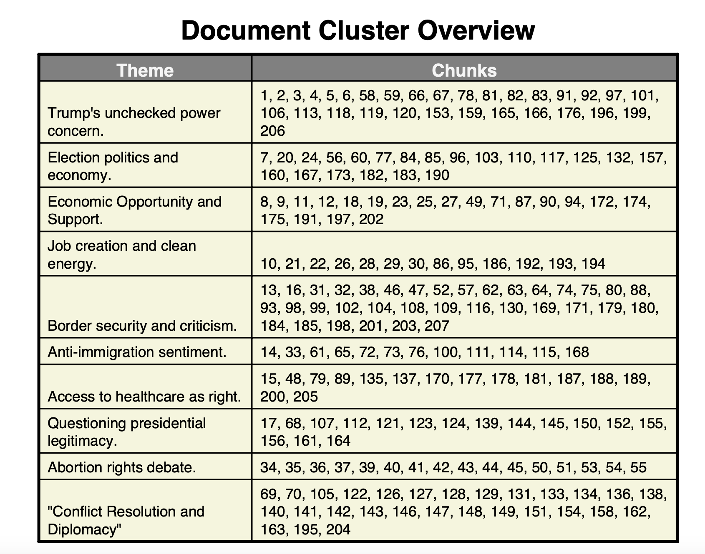
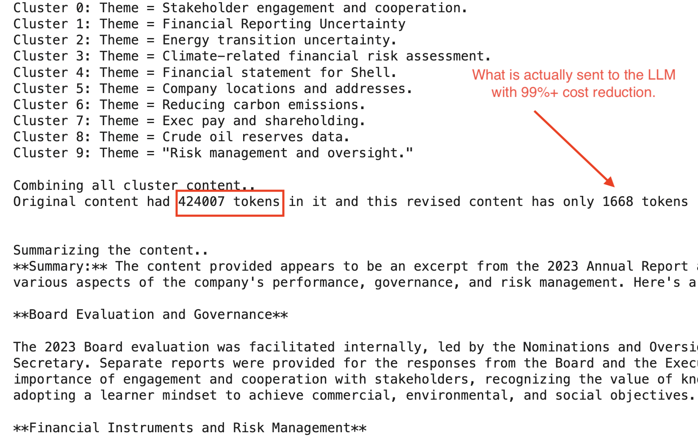
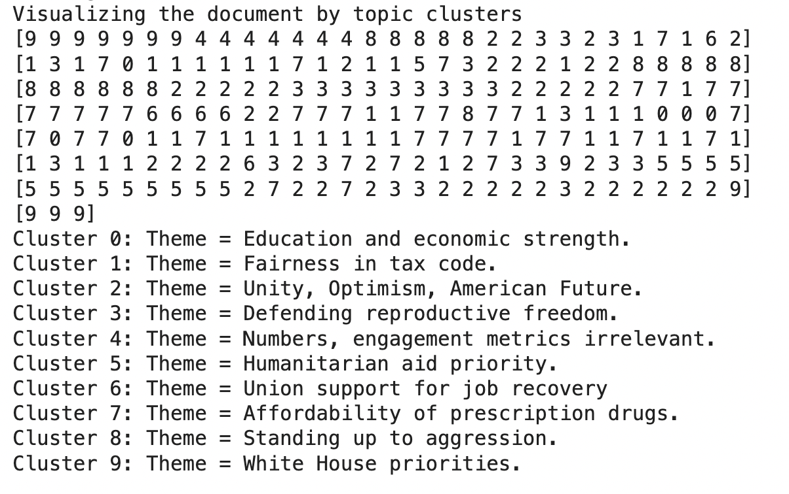

<p align="center">
  
</p>

**BrahmaSumm** is an advanced document summarization and visualization tool designed to streamline document management, knowledge base creation, and chatbot enhancement. By leveraging cutting-edge chunking and clustering techniques, BrahmaSumm reduces token usage sent to Large Language Models (LLMs) by up to 99%, while maintaining the quality of content. The tool provides intuitive document processing, stunning visualizations, and efficient querying across multiple formats.

Automatically identify themes and look at your documents in an whole another way!
<p align="center">
  
</p>

At a fraction cost of directly sending to LLM, we can do a deep analysis of themes and other parts of the document, besides an elaborate summary. Here is a visual view of the first debate between Harris and Trump.

<p align="center">
  
</p>

We can achieve dramatic cost reduction!
<p align="center">
  
</p>

## Features (v0.1)
- **Multi-format support**: Summarize and visualize content from PDFs, YouTube videos, audio files, HTML, spreadsheets, and Google Drive folders.
- **Clustering-based summarization**: BrahmaSumm intelligently chunks and clusters documents, extracting key insights while preserving quality.
- **Smart Chunking**:Compared to alternate chunking methods, we built a flexible chunking that tries to keep document structures better.
- **UMAP and other visualization**: View your documents in an intuitive, visual format that highlights clusters and relationships within the content.
- **Token reduction**: Reduce the token count sent to LLMs by up to 99% with BrahmaSumm's efficient clustering algorithms.
- **Extract Tables, Images, and Text**: Seamlessly extract and summarize data from tables, images, and text within documents.
- **Vectorization for querying**: Enable powerful document querying by vectorizing content for efficient search and retrieval.

Understand the flow of ideas in a document broken into paragraphs.
<p align="center">
  
</p>

## Use Cases
- **Document Management**: Organize and retrieve key information from large document sets across different formats.
- **Chatbots**: Enhance chatbot responses with intelligent document summarization and retrieval.
- **Knowledge Base Creation**: Build robust knowledge bases from diverse content, enabling easy access to summarized insights.

## How It Works
1. **Chunking**: Documents are split into manageable, semantically meaningful chunks using advanced methods that avoid arbitrary splits.
2. **Clustering**: These chunks are clustered based on similarity, reducing the number of tokens sent to LLMs while retaining the core information.
3. **Visualization**: Use UMAP to visualize the document clusters, making the structure of the document easy to understand.
4. **Summarization**: BrahmaSumm generates high-quality summaries of your documents, even across large datasets.
5. **Vectorization**: Each chunk is vectorized, enabling efficient querying and advanced document retrieval.

## Planned Enhancements
- **Enhanced query-based summarization**: Enable users to query specific sections or keywords for customized summaries.
- **Support for more formats**: Expand format support to include additional document types.
- **Integration with enterprise tools**: API integrations with popular enterprise tools like Slack, Microsoft Teams, and more.

## Installation

Clone the repository and install the required dependencies:
```bash
git clone https://github.com/your-repo/BrahmaSumm.git
cd BrahmaSumm
pip install -r requirements.txt
